# Open Power/Performance Analysis Tool (OPPAT)

# Table of Contents
- [Introduction](#introduction)
- [Types of data supported](#oppat-data-supported)
- [OPPAT visualization](#oppat-visualization)
    - [chart features](#chart-features)
    - [chart types](#chart-types)
- [Data collection for OPPAT](#data-collection-for-oppat)
- [PCM data support](#pcm-data-support)
- [Building OPPAT](#building-oppat)
- [Running OPPAT](#running-oppat)
- [Derived Events](#derived-events)
- [Using the browswer GUI Interface](#using-the-browswer-gui-interface)
- [Limitations](#limitations)

--------------------------------------------------------------------------------
## Introduction
Open Power/Performance Analysis Tool (OPPAT) is a cross-OS, cross-architecture Power and Performance Analysis Tool.
- cross-OS: supports Windows ETW trace files and Linux/Android perf/trace-cmd trace files
- cross-architecture: supports Intel and ARM chips hardware events (using perf and/or PCM)

The project web page is [https://patinnc.github.io](https://patinnc.github.io)

The source code repo is [https://github.com/patinnc/oppat](https://github.com/patinnc/oppat)

I've added a CPU block diagram feature. I've added a full sample HTML sample file below. See [Intel Haswell with CPU diagram 4-CPU chip, linux OS, html file with 50+ hw events via perf sampling](sample_html_files/lnx_haswell_cpu_diagram_mem_bw7.html). cpu_diagram features:
- start with a block diagram svg,
- look at the resource constraints (such as max BW, max bytes/cycle on various paths, minimum cycles/uop, etc),
- compute metrics for the resource usage
- display the resource usage info in a table (along with an estimate of whether the CPU is stalled due to the usage). Below is a PNG image of the table. The html table (but not the PNG) has popup info when you hover over fields. The table shows that:
    - the core is stalled on memory bandwidth at 55% of the max possible 25.9 GB/s BW. It is a memory bw test
    - the SuperQueue (SQ) is full (54.5% for core0 and 62.3% core1) of the cycles (so more L2 requests can't be handled)
    - the line fill buffer FB is full (30% and 51%) so lines can't be moved to L1d from L2
    - the result is that the backend is stalled (90% and 97%) of the cycles no UOPs are retired.
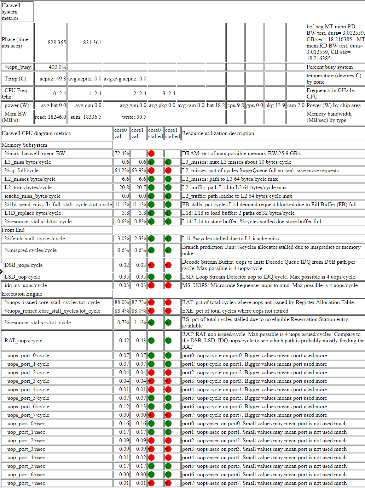
    - Below is a table of an L3 read bandwidth test. No the memory BW is near zero.
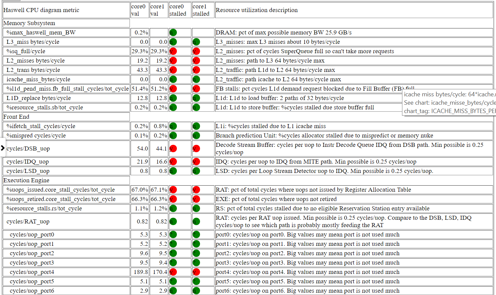
    - Below is a table of an L2 read bandwidth test. The L3 BW is near zero.
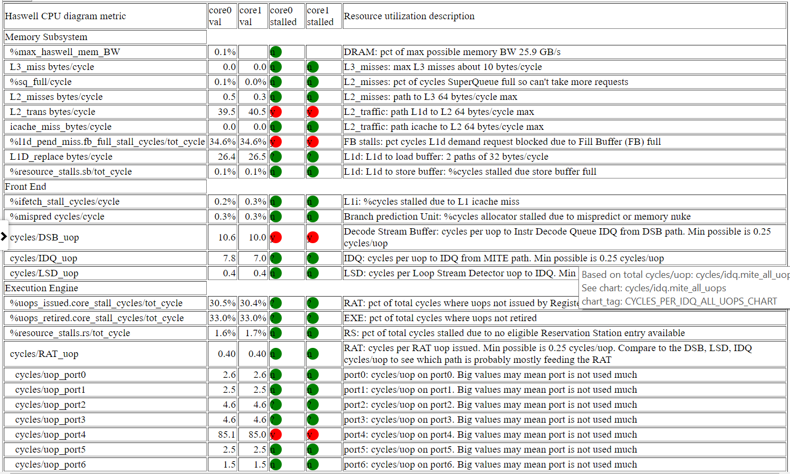
    - Below is a table of a spin test (no loads, just do adds in a loop).

- display the block diagram with the metric usage by the block for the resource. Below is a PNG image of the cpu_diagram canvas. The html canvas drawing (but not the PNG) displays popup info when you hover over text.
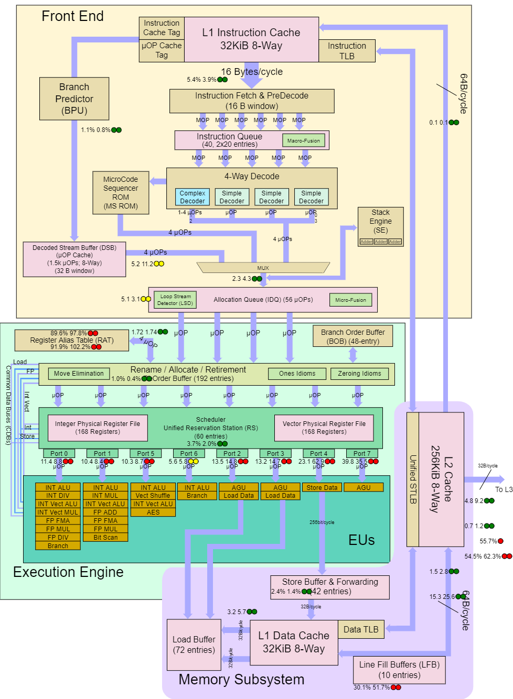

Currently this is only available for haswell (I don't have other systems to test on) but it shouldn't be hard to add other block diagrams.

Below is one of the OPPAT charts. The 'cpu_busy' chart shows what is running on each CPU and the events that happen on each cpu. For example, the green circle shows a spin.x thread running on CPU 1. The red circle shows some of the events occurring on CPU1. This chart is modeled after trace-cmd's kernelshark chart. More info on the cpu_busy chart is in [chart-types section](#chart-types). The callout box shows the event data (including callstack (if any)) for the event under the cursor. Unfortunately windows screenshot doesn't capture the cursor.
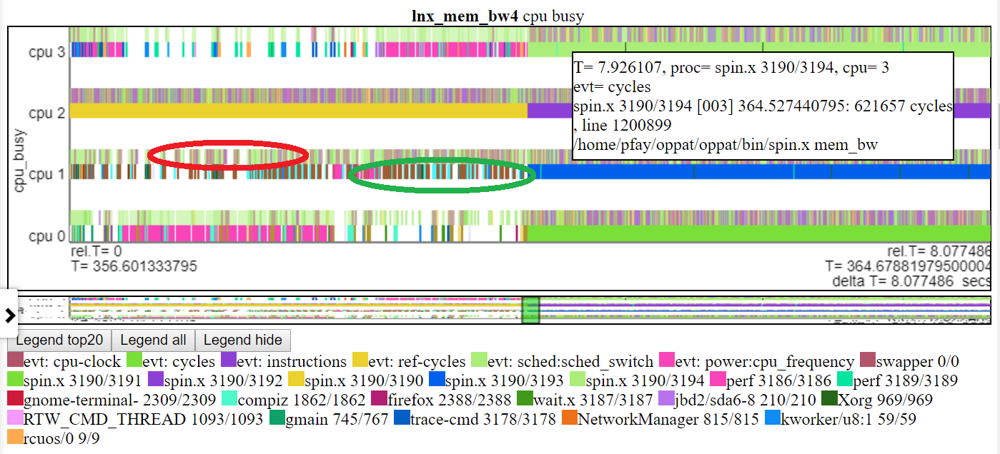

Here are some sample html files. Most of the files are for a shorter ~2 interval but some are 'full' 8 second runs. The files won't load directly from the repo but they will load from the project web page: [https://patinnc.github.io](https://patinnc.github.io)
- [Intel Haswell with CPU diagram 4-CPU chip, linux OS, html file with 50+ hw events via perf sampling](sample_html_files/lnx_haswell_cpu_diagram_mem_bw7.html) or
- [Intel 4-CPU chip, Windows OS, html file with 1 hw events via xperf sampling](sample_html_files/win_mem_bw4.html) or
- [full ~8 second Intel 4-CPU chip, Windows OS, html file with PCM and xperf sampling](sample_html_files/win_mem_bw4_pcm.html) or
- [Intel 4-CPU chip, Linux OS, html file with 10 hw events in 2 multiplexed groups](sample_html_files/lnx_mem_bw4.html).
- [ARM (Broadcom A53) chip, Raspberry Pi3 Linux html file with 14 hw events (for CPI, L2 misses, mem BW etc in 2 multiplexed groups)](sample_html_files/arm_mem_bw4_pi4.html).
- [11 MB, full version of above ARM (Broadcom A53) chip, Raspberry Pi3 Linux html file with 14 hw events (for CPI, L2 misses, mem BW etc in 2 multiplexed groups)](sample_html_files/arm_mem_bw4_pi4_full.html).

Some of the above files are ~2 second intervals extracted from ~8 second long runs. Here is the full 8 second run:
- [the full 8 second Linux run sample html compressed file here](sample_html_files/lnx_mem_bw4_full.html) for a more complete file. The file does a javascript zlib decompress of the chart data so you will see messages asking you to wait (about 20 secs) during the decompress.

--------------------------------------------------------------------------------
## OPPAT data supported
- Linux perf and/or trace-cmd performance files (both binary and text files),
    - perf stat output also accepted
    - So this should work with data from regular Linux or Android
    - Currently for perf and trace-cmd data, OPPAT requires both the binary and post-processed text files and there are some restrictions on the 'record' command line and the 'perf script/trace-cmd report' command line.
    - OPPAT could be made to just use the perf/trace-cmd text output files but currently both binary and text files are required
- Windows ETW data (collected by xperf and dumped to text),
- arbitrary power or performance data supported using LUA scripts (so you don't need to recompile the c++ code to import other data (unless the LUA performance becomes an issue))
- read the data files on Linux or Windows regardless of where the files originated (so read perf/trace-cmd files on Windows or ETW text files on Linux)

--------------------------------------------------------------------------------
## OPPAT visualization
Here are some full sample visualzation html files: [windows sample html file](sample_html_files/win_mem_bw4.html) or [this Linux sample html file](sample_html_files/lnx_mem_bw4.html). If you are on the repo (not the github.io project website) you will have to download the file and then load it into your browser. These are standalone web files created by OPPAT which could be, for example, emailed to others or (as here) posted on a web server.

OPPAT viz works better in Chrome than Firefox primarily because the zoom using touchpad 2 finger scrolling works better on Chrome.


OPPAT has 3 visualization modes:
1. The usual chart mechanism (where OPPAT backend reads the data files and sends data to the browser)
2. You can also create a standalone web page which is the equivalent of the 'regular chart mechanism' but can be exchanged with other users... the standalone web page has the all the scripts and data built-in so it could be emailed to someone and they could load it in their browser. See the html files in sample_html_files referenced above and (for a longer version of lnx_mem_bw4) see the compressed file [sample_html_files/lnx_mem_bw4_full.html](sample_html_files\lnx_mem_bw4_full.html)
3. You can '--save ' a data json file and then --load the file later. The saved json file has is the data which OPPAT needs to send to the browser.  This avoids re-reading the input perf/xperf files but it won't pick up any changes made in charts.json. The full HTML file created with the --web_file option is only slightly bigger than the --save file. The --save/--load mode requires building oppat. See the sample 'saved' files in sample_data_json_files subdir.

Viz general info
- chart all the data in a browser (on Linux or Windows)
- charts are defined in a json file so you can add events and charts without recompiling OPPAT
- browser interface is sort of like Windows WPA (navbar on left). 
    - Below shows the left navbar (left side sliding menu).
    - 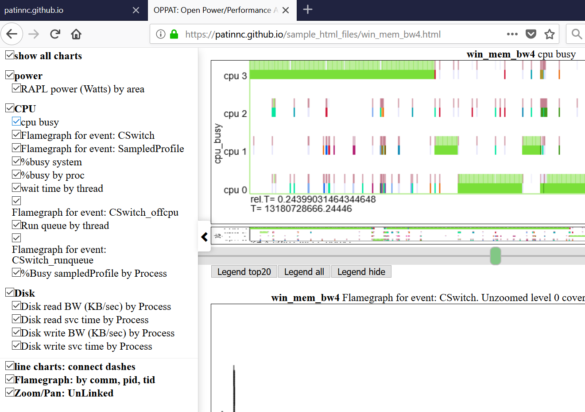
    - charts are grouped by category (GPU, CPU, Power, etc)
        - categories are defined and assigned in input_files/charts.json
    - charts can be all hidden or selectively displayed by clicking on the chart in the navbar.
    - hovering over a chart title in the left nav menu scrolls that chart into view
- data from one group of files can be plotted along side a different group
    - so you can say, compare a Linux perf performance vs a Windows ETW run
    - Below chart show Linux vs Windows power usage:
    - 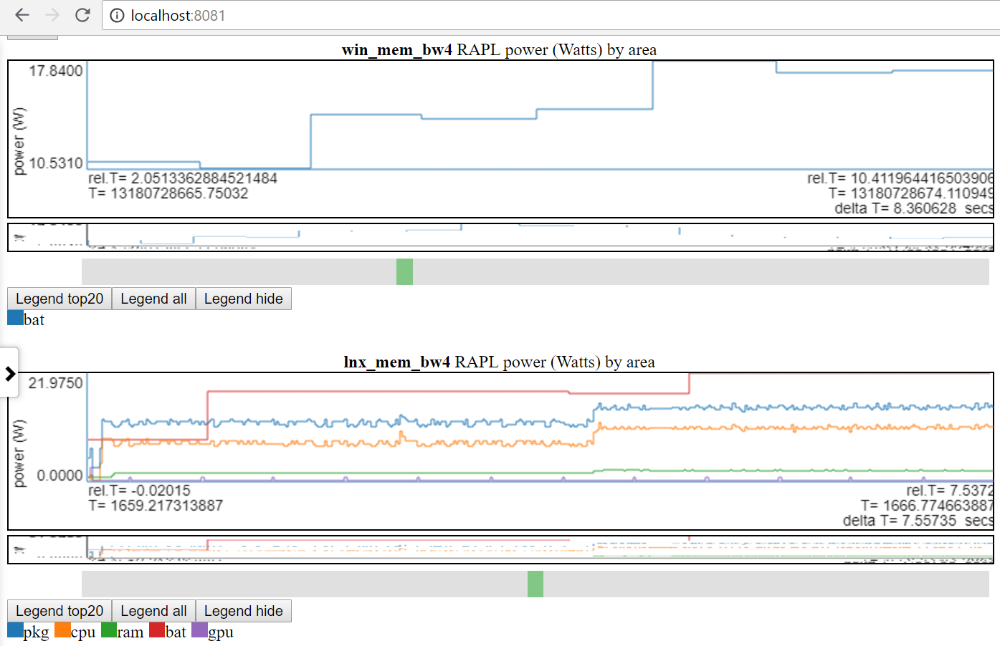
        - I only have access to battery power on both linux and windows.
        - Many sites have much better power data (voltages/currents/power at the msec (or better) rate). It would be easy to incorporate these types of power data (such as from Kratos or Qualcomm MDPs) but I don't have access to the data.
    - or compare 2 different runs on the same platform
    - a file group tag (file_tag) is prefixed to the title to distinguish charts
       - a 'tag' is defined in the data dir's file_list.json file and/or input_files/input_data_files.json
       - the input_files/input_data_files.json is a list of all the OPPAT data dirs (but the user has to maintain it).
    - Charts with the same title are plotted one after the other to allow easy comparison

#### chart features:
- hovering over a section of a line of the chart shows the data point for that line at that point
    - this doesn't work for the vertical lines since they are just connecting 2 points... only the horizontal pieces of each line is searched for the data value
    - Below is a screenshot of hovering over event. This shows the relative time of the (CSwtich) event, some info like process/pid/tid and the line number in the text file so you can get more info.
    - 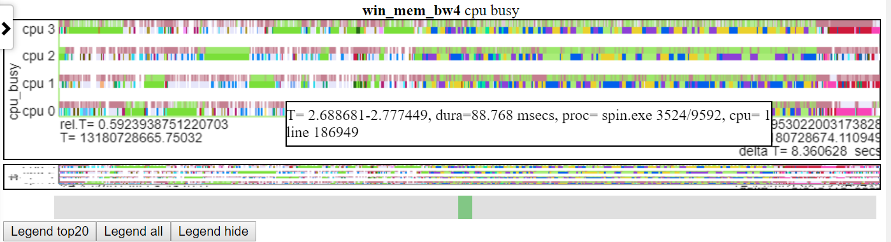
    - Below is a screenshot showing the callstack info (if any) for events.
    - 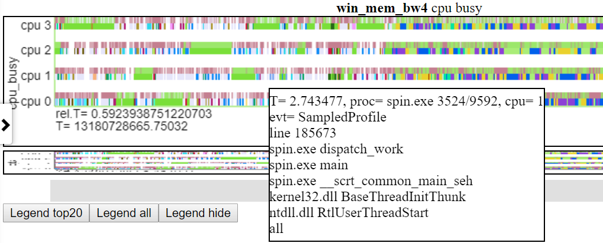
- zooming
    - unlimited zooming in to nanosec level and zooming back out.
        - there are probably orders of magnitude more points to plot than pixels so more data is displayed as you zoom in.
        - below is a screenshot showing zooming to the microsecond level.  This shows the callstack for sched_switch event where spin.x is blocked by doing memory mapping operation and going idle. The 'cpu busy' chart shows 'going idle' as blank.
        - 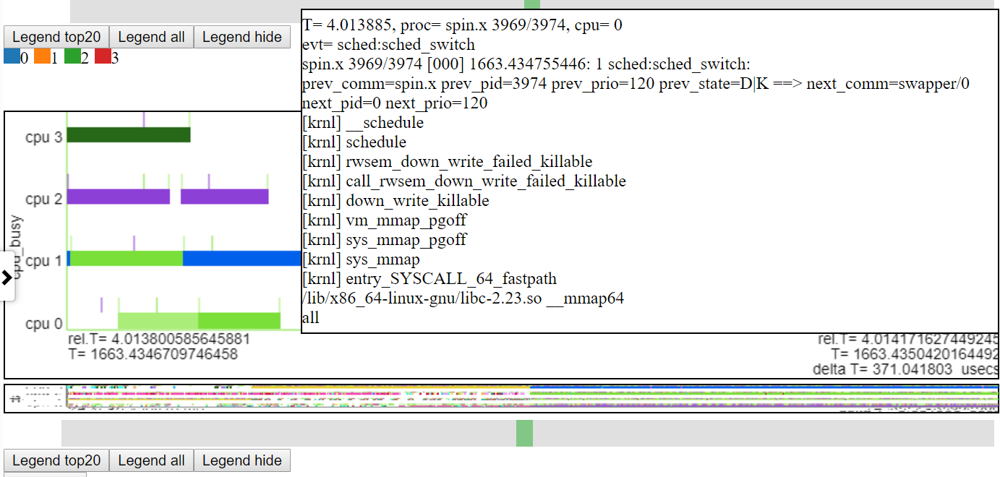.
    - charts can be zoomed individually or charts with the same file_tag can be linked so that zooming/panning 1 chart changes the interval of all the charts with the same file_tag
        - Scroll to the bottom of the left navbar and click on 'Zoom/Pan: Unlinked'. This will change the menu item to 'Zoom/Pan: Linked'. This will zoom/pan all the charts in a file group to the most recent zoom/pan absolute time. This will take some time to redraw all the charts. 
             - Initially each chart is drawn displaying all of the available data. If your charts are from different sources then the T_begin and T_end (for charts from different sources) is probably different.
             - Once a zoom/pan operation is done all and linking is in effect then all charts in the file group will zoom/pan to the same absolute interval.
                 - This is why the 'clock' used for each source has to be the same.
                 - OPPAT could translate from one clock to another (such as between gettime(CLOCK_MONOTONIC) and gettimeofday()) but that logic 
             - Any flamegraphs for an interval are always zoomed to the 'owning charts' interval regardless of the linking status.
    - You can zoom in/out by:
        - zoom in: mouse wheel vertically on the chart area. The chart zooms on the time in the center of the chart.
             - on my laptop this is doing scrolling 2 fingers vertically on the touchpad
        - zoom in: clicking on chart and dragging the mouse to the right and releasing the mouse (the chart will zoom to the selected interval)
        - zoom out: clicking on chart and dragging the mouse to the left and releasing the mouse will zoom out in sort of inversely proportional to how much of the chart you selected. That is, if you left drag almost the whole chart area then the chart will zoom back out ~2x. If you just left drag a small interval then the chart will zoom out the ~whole way.
        - zoom out: on my laptop, doing a touchpad 2 finger vertical scroll in the opposite direction of zoom 
    - You have to be careful where the cursor is... You might inadvertently zoom a chart when you mean to scroll the list of charts. So I usually put the cursor on the left edge of the screen when I want to scroll the charts.

- panning 
    - on my laptop this is doing 2 fingers on horizontal scroll motion on the touchpad
    - using the green box on the thumbnail below the chart 
    - panning works at any zoom level
    - a 'thumbnail' picture of the full chart is put below each chart with a cursor to slide along the thumbnail so you can navigate around the chart when you are zooming/panning
    - Below shows panning the 'cpu busy' chart to T=1.8-2.37 seconds. The relative time and absolute begin time is highlighed in the left red oval. The end time is highlighted in the right-side red oval. The relative position on the thumbnail is shown by the middle red oval.
    - 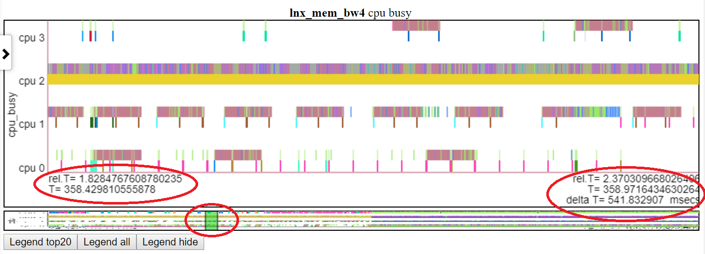.
- hovering on a chart legend entry highlights that line. 
    - Below is a screenshot where 'pkg' (package) power is highlighted
    - 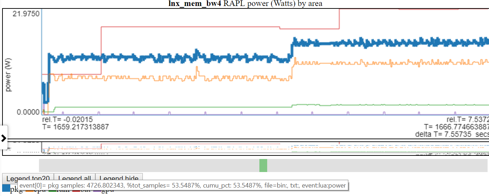
- clicking on a chart legend entry toggles the visibility of that line.
- double clicking a legend entry makes only that entry visible/hidden
    - Below is a screenshot where 'pkg' power was double clicked so only the pkg line is visible.
    - 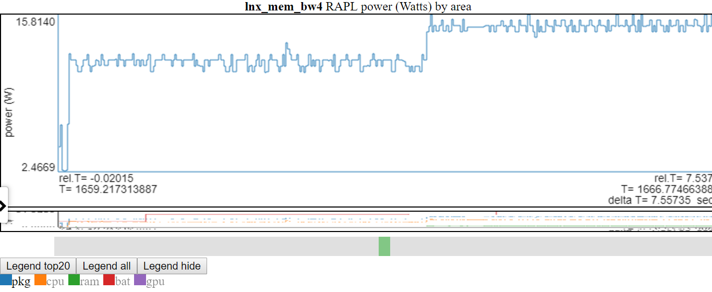
    - Above shows the y-axis is adjusted to min/max of the displayed variable(s). The 'not shown' lines are greyed-out in the legend. If you hover over a 'not shown' line in the legend it will be drawn (while you are hovering on the legend item). You can get all the items to display again by double-clicking a 'not-shown' legend entry. This will show all the 'not shown' lines but it will toggle off the line you just clicked... so single-click the item you just double-clicked. I know it sounds confusing. 
- if a legend entry is hidden and you hover over it, it will be displayed until you hover out

#### chart types:
- 'cpu busy' chart: a kernelshark-like chart showing the cpu occupancy by pid/thread. See kernelshark reference http://rostedt.homelinux.com/kernelshark/
    - Below is a screenshot of the cpu busy chart. The chart shows, for each cpu, the process/pid/tid running at any point in time. The idle process is not drawn. For 'cpu 1' on the screenshot, the green oval is around the 'context switch' part of the chart. Above each cpus' context switch info, cpu busy shows the events that present in the same file as the context switch event. The red oval on the cpu 1 line shows the event part of the chart.
    - 
    - the chart is based on the context switch event and shows the thread running on each cpu at any given time
    - the context switch event is the Linux sched:sched_switch or the Windows ETW CSwitch event.
    - if there are more events than the context switch in the data file then all of the other events are represented as vertical dashes above the cpu.
    - if the events have call stacks then the call stack is also shown in the popup balloon
- line charts
    - The line charts are probably more accurately called step charts since each event (so far) has a duration and these 'durations' are represented by horizontal segments and joined by vertical segments.
    - the vertical part of the step chart can fill a chart if chart lines have a lot of variation
    - you can select (in the left nav bar) to not connect the horizontal segments of each line... so the chart becomes a sort of 'scattered dash' chart. The 'horizonatal dashes' are the actual data points. When you switch from step chart to dash chart, the chart is not redrawn until there is some 'redraw' request (like zoom/pan or highlight (by hovering over a legend entry)).
        - Below is a screenshot of cpu_idle power states using line chart. The connecting lines blot out the information in the chart.
        - 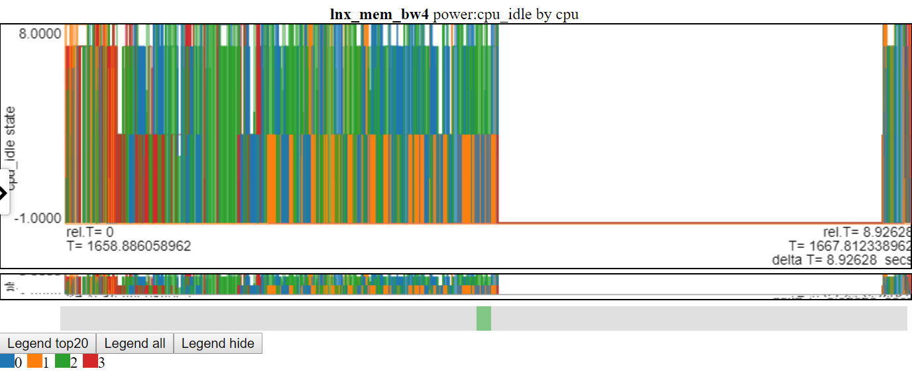
        - Below is a screenshot of cpu_idle power states using scattered-dash chart. The chart now shows a horizontal dash for data point (the width of the dash is the duration of the event). Now we can see more information but this chart also shows a drawback with my charting logic: a lot of the data is at the max value and at the min Y value of the chart and it gets obscured.
        - 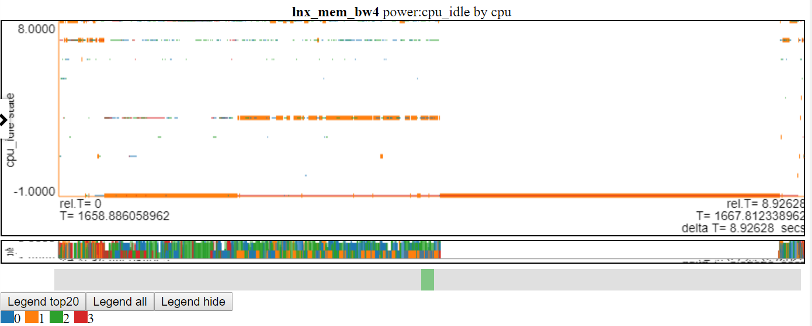

- stacked charts
    - Stacked charts can cause a lot more data to be generated than line charts. For example, drawing a line chart of when a particular thread is running only depends on that thread. Drawing a stacked chart for running threads is different: a context switch event on any thread will change all the other running threads... so if you have N cpus, you will get N-1 more things to draw per event for stacked charts.
- flamegraphs. For each perf event which has callstacks and is in same file as the sched_switch/CSwitch event, a flamegraph is created.
    - Below is a screenshot of a typical default flamegraph.  Usually the default height of the flamegraph chart isn't sufficient to fit the text into each level of the flamegraph. But you still get the 'hover' callstack info.
    - 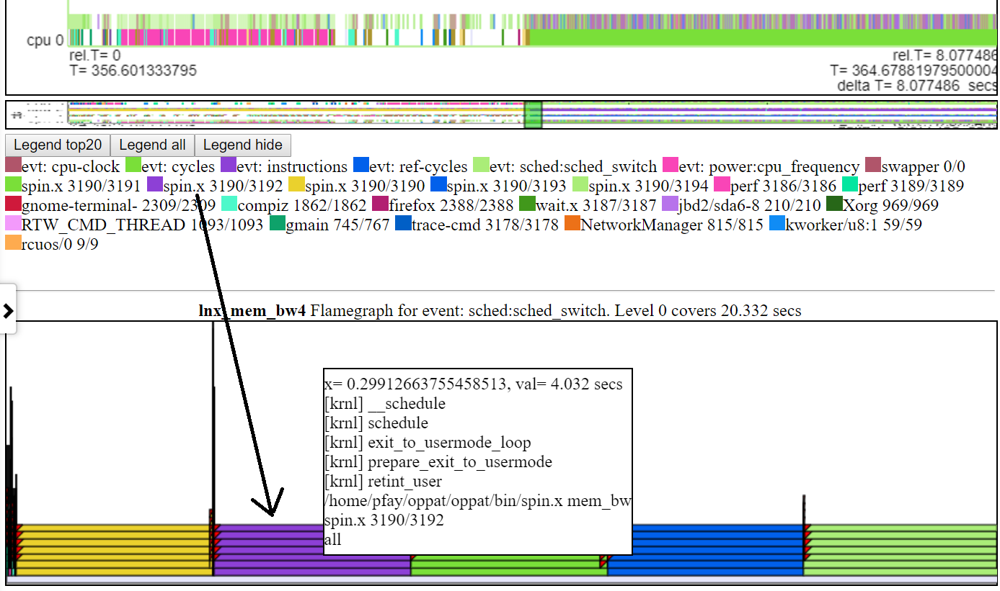.
    - If you click on layer of the chart, it expands higher such that the text fits. If you click on the lowest layer then it covers all data for the interval of the 'owning chart'.
    - Below is a screenshot of a zoomed flamegraph (after clicking on one of the layers of a flame).
    - 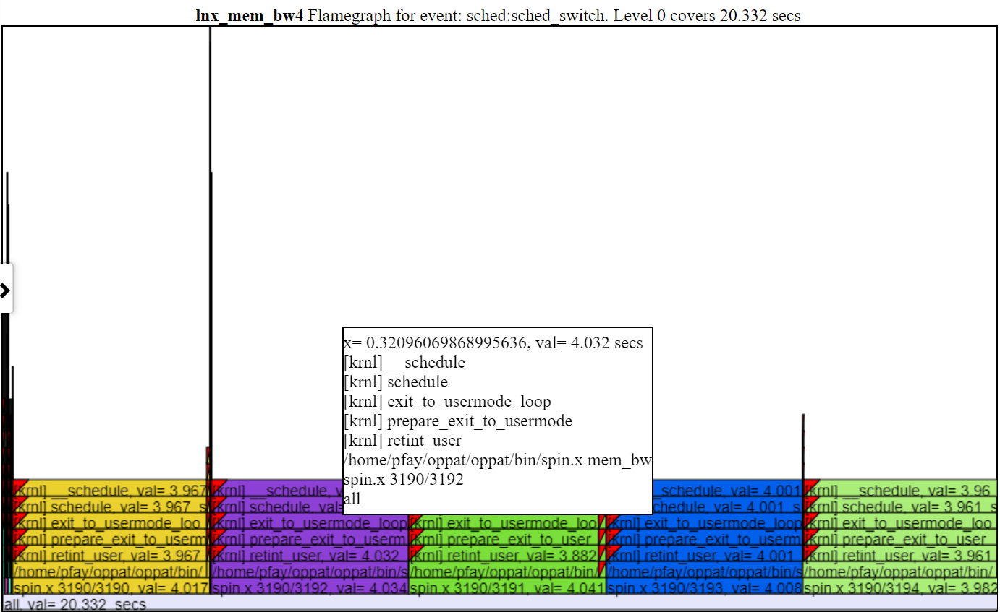.
    - Usually the default height of the flamegraph chart isn't sufficient to fit the text into each level of the flamegraph. But you still get the 'hover' callstack info.
    - the color of the flamegraph matches the process/pid/tid in the legend of cpu_busy chart... so it is not as pretty as a flamegraph but now the color of a 'flame' actually means something.
    - the CPI (Clocks Per Instruction) flamegraph chart colors the process/pid/tid by the CPI for that stack.
        - Below is a sample unzoomed CPI chart. The left-hand instance of spin.x (in light orange) has a CPI = 2.26 cycles/instruction. The 4 spin.x's at the right in light green have a CPI= 6.465.
        - 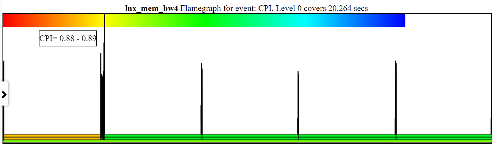
        - You have to have cycles, instructions, and cpu-clock (or sched_switch) callstacks
        - The width of the CPI 'flame' is based on the cpu-clock time.
        - The color is based on the CPI. A red to green to blue gradient at the top left of the chart shows the coloring.
        - Red is a low CPI (so lots of instructions per clock ... I think of it as 'hot')
        - Blue is a high CPI (so few instructions per clock ... I think of it as 'cold')
        - Below is a sample zoomed CPI chart showing the coloring and the CPI. The 'spin.x' threads have been deselected in the cpu_busy legend so they don't appear in the flamegraph.
        - 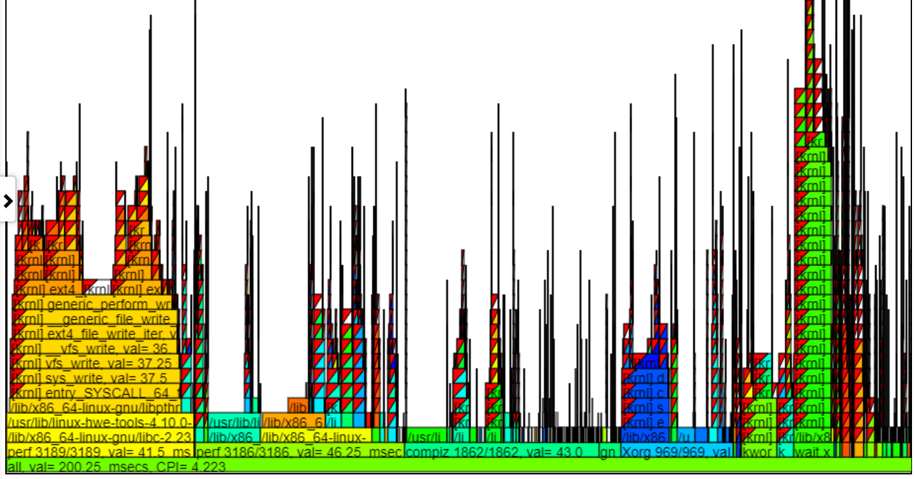
    - the GIPS (Giga (billion) Instructions Per Second) flamegraph chart colors the process/pid/tid by the GIPS for that stack.
        - Below is a sample unzoomed GIPS (Giga/Billion Instructions per Second) chart. The left-hand instance of spin.x (in light green) has a GIPS = 1.13. The 4 spin.x's at the right in blue green have a GIPS= 0.377. The callstack in the balloon is for one the spike callstacks to the left of the balloon.
        - 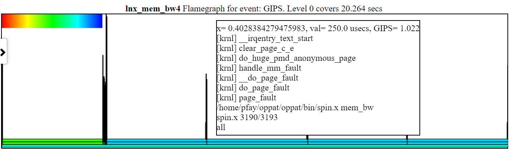
        - In the above chart note that the left hand stack (for spin.x) get a higher instructions/sec than the rightmost 4 instances of spin.x. These 1st instance of spin.x runs by itself (so gets lots of memory BW) and right 4 spin.x threads run in parallel and get a lower GIPS (since one thread can  just about max out the memory BW).
        - You have to have instructions and cpu-clock (or sched_switch) callstacks
        - The width of the GIPS 'flame' is based on the cpu-clock time.
        - The color is based on the GIPS. A red to green to blue gradient at the top left of the chart shows the coloring.
        - Red is a high GIPS (so lots of instructions per second ... I think of it as 'hot' doing lots of work)
        - Blue is a low GIPS (so few instructions per second ... I think of it as 'cold')
        - Below is a sample zoomed GIPS chart showing the coloring and the GIPS. I clicked on the 'perf 3186/3186' so just that flame is shown below.
        - 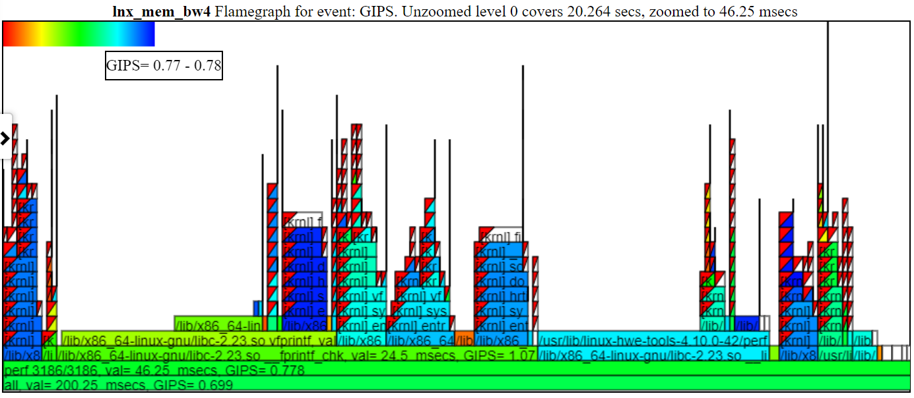
    - if you hide a process in the legend (click on the legend entry...it will be greyed out) then the process will not be shown in the flamegraph.
    - if you right drag the mouse in the flamegraph that section of the flamegraph will be zoomed 
    - clicking on a 'flame' zooms to just that flame
    - left dragging the mouse in the flamegraph will zoom out
    - clicking a lower level of the flamegraph 'unzooms' to all the data for that level
    - if you click on the 'all' lowest level of the flamegraph you will zoom all the way back out
    - when you click on flamegraph level the chart is resized so that each level is high enough to display the text. This causes the chart to resize. To try and add some sanity to this resizing, I position the last level of the resized chart to bottom of the visible screen.
    - if you go back into the legend and hover over a hidden entry then that entry will be shown in the flamegraph until you hover out
    - if you click on a 'flame' upper level then just that section will be zoomed.
    - if you zoom in/out on the 'parent' chart then the flamegraphs will be redrawn for the selected interval
    - if you pan left/right on the 'parent' chart then the flamegraphs will be redrawn for the selected interval
    - by default the text of each level of the flame graph will probably not fit. If you click on flamegraph then the size will be expanded to enable drawing the text too
    - you can select (in the left nav bar) whether to group the flamegraphs by process/pid/tid or by process/pid or by just process.
    - both 'on cpu', 'off cpu' and 'run queue' flamegraphs are drawn.
        - 'on cpu' is the callstack for what the thread was doing while it was running on the cpu... so the SampledProfile callstacks or perf cpu-clock callstacks indicate what the thread was doing when it was running on the cpu
        - 'off cpu' shows, for threads that not running, how long they were waiting and the callstack when they got swapped out.
            - Below is a screenshot of the off-cpu or wait-time chart. The popup shows (in the flamegraph) that 'wait.x' is waiting on nanosleep.
            - 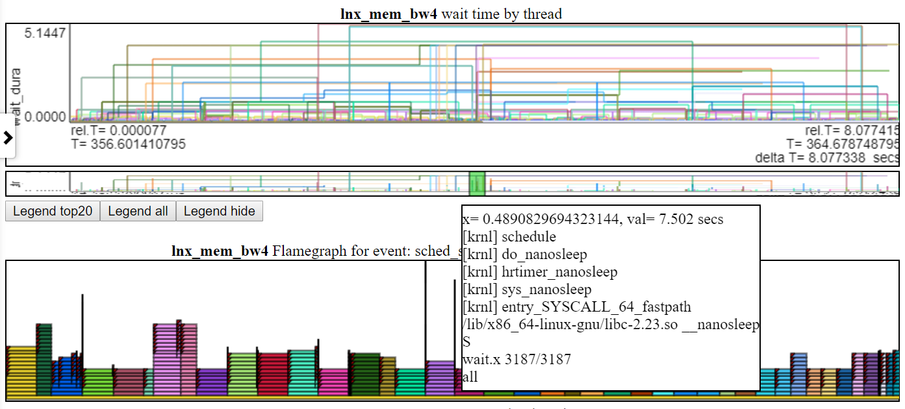
            - The swap 'state' (and on ETW the 'reason') is shown as a level above the process. Usually most threads will be sleeping or not running but this helps one to answer the question: "when my thread didn't run... what was it waiting on?". 
            - Showing the 'state' for the context switch lets you see: 
            - for example, whether a thread is waiting on an non-interruptible sleep (state==D on Linux...usually IO)
            - interruptible sleep (state=S... frequently a nanosleep or futex)
        - 'run queue' shows the threads that got swapped and were in a running or runnable state. So this chart shows saturation of the CPU if there are threads in a runnable state but not running.
            - Below is screenshot of the run_queue chart. This chart shows the amount time a thread didn't run because there wasn't enough CPU. That is, it was ready to run but something else was using the CPU. Each flamegraph shows the total covered in the graph. In the case of the run_queue chart, it shows ~159 msecs in wait time. So, given that spin.x has about 20 seconds run time and 0.159 secs 'wait' time, that doesn't seem too bad.
            - 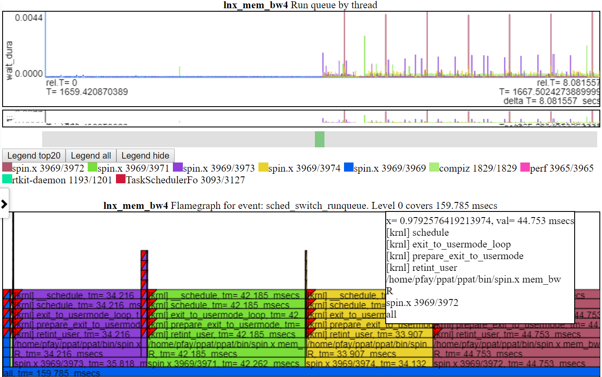
- I didn't have a canvas-based chart library to use so the charts are kind of crude... I didn't want to spend too much time creating the charts if there is something better out there. The charts have to use the HTML canvas (not SVGs, d3.js etc) due to the amount of data.


--------------------------------------------------------------------------------
## Data collection for OPPAT

Collecting the performance and power data is very 'situational'. One person will want to run scripts, another will want to start measurements with a button, then start a video and then end the collection with the press of a button.
I have a script for Windows and a script for Linux which demonstrates:
- starting data collection, 
- running a workload,
- stop data collection
- post-process the data (creating a text file from the perf/xperf/trace-cmd binary data)
- putting all the data files in an output dir
- creating a file_list.json file in the output dir (which tells oppat the name and type of the output files)

The steps for data collection using the scripts:
- Build spin.exe (spin.x) and wait.exe (wait.x) utilities
    - from the OPPAT root dir do:
    - on Linux: ```./mk_spin.sh```
    - on Windows: ```.\mk_spin.bat``` (from a Visual Studio cmd box)
    - The binaries will be put in the ./bin subdir
- Start with running the provided scripts:
    - run_perf_x86_haswell.sh - for the haswell cpu_diagram data collection
        - On Linux, type: ```sudo bash ./scripts/run_perf.sh```
        - By default the script puts the data in dir ../oppat_data/lnx/mem_bw7
    - run_perf.sh - You need to have trace-cmd and perf installed
        - On Linux, type: ```sudo bash ./scripts/run_perf.sh```
        - By default the script puts the data in dir ../oppat_data/lnx/mem_bw4
    - run_xperf.bat - you need to have xperf.exe installed.
        - On Windows, from a cmd box with admin privileges, type: ```.\scripts\run_xperf.sh```
        - By default the script puts the data in dir ..\oppat_data\win\mem_bw4
    - Edit the run script if you want to change the defaults
    - In addition to the data files, the run script creates a file_list.json file in the output dir. OPPAT uses the file_list.json file to figure out the filenames and the type of files in the output dir.
- The 'workload' for the run script is spin.x (or spin.exe) which does a memory bandwidth test on 1 cpu for 4 seconds and then on all cpus for another 4 seconds.
- Another program wait.x/wait.exe is also started in the background. wait.cpp reads the battery info for my laptop. It works on my dual boot Windows 10/Linux Ubuntu laptop. The sysfs file might have a different name on your Linux and almost surely is different on Android. 
- On Linux, you could probably just generate a prf_trace.data and prf_trace.txt file using the same syntax as is in run_perf.sh but I haven't tried this.
- If you are running on a laptop and want to get the battery power, remember to disconnect the power cable before you run the script.

--------------------------------------------------------------------------------
## PCM data support

- OPPAT can read and chart PCM .csv files.
- Below is a snapshot of the list of charts created.
    - 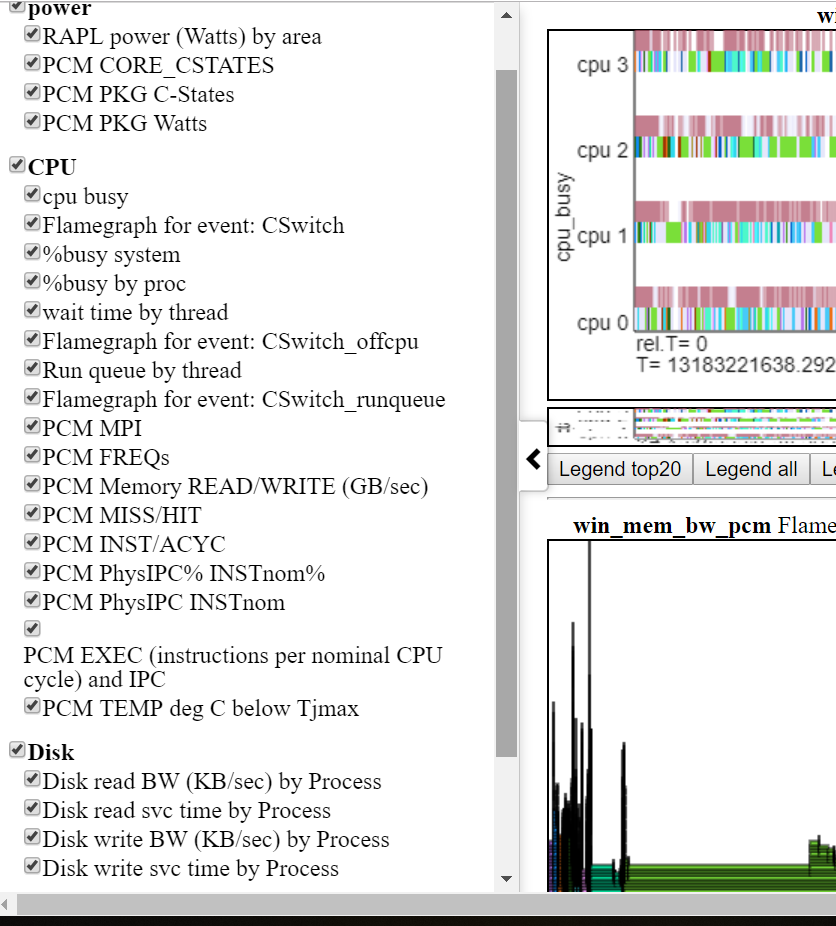
- Unfortunately you have to do a patch to PCM to create a file with an absolute timestamp for OPPAT to process.
    - This is because PCM csv file doesn't have a timestamp I can use to correlate with the other data sources.
- I've added the patch here [PCM patch](PCM_patch/pcm_20181006_patch.txt)

--------------------------------------------------------------------------------
## Building OPPAT

- On Linux, type ```make``` in the OPPAT root dir
    - If everything works there should be a bin/oppat.x file
- On Windows, you need to:
    - install the Windows version of gnu make. See http://gnuwin32.sourceforge.net/packages/make.htm or, for just the minimum required binaries, use http://gnuwin32.sourceforge.net/downlinks/make.php
    - put this new 'make' binary in the path
    - You need a current Visual Studio 2015 or 2017 c/c++ compiler (I used both the VS 2015 professional and the VS 2017 community compilers)
    - start a Windows Visual Studio x64 native cmd prompt box
    - type ```make``` in the OPPAT root dir
    - If everything works there should be a bin\oppat.exe file
- If you are changing the source code you probably need to rebuild the include dependency file
    - You need to have perl installed
    - on Linux, in the OPPAT root dir do: ```./mk_depends.sh```. This will create a depends_lnx.mk dependency file.
    - on Windows, in the OPPAT root dir do: ```.\mk_depends.bat```. This will create a depends_win.mk dependency file.
- If you are going to run the sample run_perf.sh or run_xperf.bat scripts, then you need to build the spin and wait utilities:
    - On Linux: ```./mk_spin.sh```
    - On Windows: ```.\mk_spin.bat```


--------------------------------------------------------------------------------
## Running OPPAT

- Run the data collection steps [above](#data-collection-for-oppat)
    - now you have data files in a dir (if you ran the default run\_\* scripts:
       - on Windows ..\oppat_data\win\mem_bw4
       - on Linux ../oppat_data/lnx/mem_bw4
    - You need to add the created files to the input_files\input_data_files.json file:
- Starting OPPAT reads all the data files and starts the web server
- on Windows to generate the haswell cpu_diagram (assuming your data dir is ..\oppat_data\lnx\mem_bw7)
```
   bin\oppat.exe -r ..\oppat_data\lnx\mem_bw7 --cpu_diagram web\haswell_block_diagram.svg > tmp.txt
```
- on Windows (assuming your data dir is ..\oppat_data\win\mem_bw4)
```
   bin\oppat.exe -r ..\oppat_data\win\mem_bw4 > tmp.txt
```
- on Linux (assuming your data dir is ../oppat_data/lnx/mem_bw4)
```
   bin/oppat.exe -r ../oppat_data/lnx/mem_bw4 > tmp.txt
```
- Now connect your browser to localhost:8081

- You can create a standalone HTML file with the '--web_file some_file.html' option. For example:
```
   bin/oppat.exe -r ../oppat_data/lnx/mem_bw4 --web_file tst2.html > tmp.txt
```
- Then you can load the file into the browser with the URL address: ```file:///C:/some_path/oppat/tst2.html```

--------------------------------------------------------------------------------
## Derived Events
'Derived events' are new events created from 1 or more events in a data file.
- Say you want to use the ETW Win32k InputDeviceRead events to track when the user is typing or moving the mouse.
    - ETW has 2 events:
        - Microsoft-Windows-Win32k/InputDeviceRead/win:Start
        - Microsoft-Windows-Win32k/InputDeviceRead/win:Stop
    - So with the 2 above events we know when the system started reading input and we know when it stopped reading input
    - But OPPAT plots just 1 event per chart (usually... the cpu_busy chart is different)
    - We need a new event that marks the end of the InputDeviceRead and the duration of the event
- The derived event needs:
    - a new event name (in chart.json... see for example the InputDeviceRead event)
    - a LUA file and routine in src_lua subdir
    - 1 or more 'used events' from which the new event is derived
         - the derived events have to be in the same file
         - For the InputDeviceRead example, the 2 Win32k InputDeviceRead Start/Stop events above are used.
- The 'used events' are passed to the LUA file/routine (along with the column headers for the 'used events') as the events are encountered in the input trace file
    - In the InputDeviceRead lua script:
         - the script records the timestamp and process/pid/tid of a 'start' event
         - when the script gets a matching 'Stop' event (matching on process/pid/tid), the script computes a duration for the new event and passes it back to OPPAT
- A 'trigger event' is defined in chart.json and if the current event is the 'trigger event' then (after calling the lua script) the new event is emitted with the new data field(s) from the lua script.
- An alternate to the 'trigger event' method is to have the lua script indicate whether or not it is time to write the new event. For instance, the scr_lua/prf_CPI.lua script writes a '1' to a variable named '__EMIT__' to indicate that the new CPI event should be written.
- The new event will have:
   - the name (from the chart.json evt_name field)
   - The data from the trigger event (except the event name and the new fields (appended)
- I have tested this on ETW data and for perf/trace-cmd data

--------------------------------------------------------------------------------
## Using the browser GUI Interface
TBD

--------------------------------------------------------------------------------
## Defining events and charts in charts.json
TBD

--------------------------------------------------------------------------------
## Rules for input_data_files.json

- The file 'input_files/input_data_files.json' can be used to maintain a big list of all the data directories you have created.
- You can then select the directory by just specifying the file_tag like:
    - bin/oppat.x -u lnx_mem_bw4 > tmp.txt # assuming there is a file_tag 'lnx_mem_bw4' in the json file.
- The big json file requires you to copy the part of the data dir's file_list.json into input_data_files.json
    - in the file_list.json file you will see lines like:
```json
{"cur_dir":"%root_dir%/oppat_data/win/mem_bw4"},
{"cur_tag":"win_mem_bw4"},
{"txt_file":"etw_trace.txt", "tag":"%cur_tag%", "type":"ETW"},
{"txt_file":"etw_energy2.txt", "wait_file":"wait.txt", "tag":"%cur_tag%", "type":"LUA"}
```
- don't copy the lines like below from the file_list.json file: 
```json
{"file_list":[ 
  ]} 
```
- paste the copied lines into input_data_files.json. Pay attention to where you paste the lines. If you are pasting the lines at the top of input_data_files.json (after the ```{"root_dir":"/data/ppat/"},``` then you need add a ',' after the last pasted line or else JSON will complain.
- for Windows data files add an entry like below to the input_files\input_data_files.json file:
    - yes, use forward slashes:
```json
{"root_dir":"/data/ppat/"},
{"cur_dir":"%root_dir%/oppat_data/win/mem_bw4"},
{"cur_tag":"win_mem_bw4"},
{"txt_file":"etw_trace.txt", "tag":"%cur_tag%", "type":"ETW"},
{"txt_file":"etw_energy2.txt", "wait_file":"wait.txt", "tag":"%cur_tag%", "type":"LUA"}
```

- for Linux data files add an entry like below to the input_files\input_data_files.json file:

```json
{"root_dir":"/data/ppat/"},
{"cur_dir":"%root_dir%/oppat_data/lnx/mem_bw4"},
{"cur_tag":"lnx_mem_bw4"},
{"bin_file":"prf_energy.txt", "txt_file":"prf_energy2.txt", "wait_file":"wait.txt", "tag":"%cur_tag%", "type":"LUA"},
{"bin_file":"prf_trace.data", "txt_file":"prf_trace.txt", "tag":"%cur_tag%", "type":"PERF"},
{"bin_file":"tc_trace.dat",  "txt_file":"tc_trace.txt", "tag":"%cur_tag%", "type":"TRACE_CMD"},
```

- Unfortunately you have to pay attention to proper JSON syntax (such as trailing ','s)
- Here is an explanation of the fields:
    - The 'root_dir' field only needs to entered once in the json file.
        - It can be overridden on the oppat cmd line line with the ```-r root_dir_path``` option
        - If you use the ```-r root_dir_path``` option it is as if you had set ```"root_dir":"root_dir_path"``` in the json file
        - the 'root_dir' field has to be on a line by itself.
    - The cur_dir field applies to all the files after the cur_dir line (until the next cur_dir line)
        - the '%root_dir% string in the cur_dir field is replaced with the current value of 'root_dir'.
        - the 'cur_dir' field has to be on a line by itself.
    - the 'cur_tag' field is a text string used to group the files together. The cur_tag field will be used to replace the 'tag' field on each subsequent line.
        - the 'cur_tag' field has to be on a line by itself.
    - For now there are four types of data files indicated by the 'type' field:
         - type:PERF These are Linux perf files. OPPAT currently requires both the binary data file (the bin_file field) created by the ```perf record``` cmd and the ```perf script``` text file (the txt_file field).
         - type:TRACE_CMD These are Linux trace-cmd files. OPPAT currently requires both the binary dat file (the bin_file field) created by the ```trace-cmd record``` cmd and the ```trace-cmd report``` text file (the txt_file field).
         - type:ETW These are Windows ETW xperf data files. OPPAT currently requires only the text file (I can't read the binary file). The txt_file is created with ```xperf ... -a dumper``` command.
         - type:LUA These files are all text files which will be read by the src_lua/test_01.lua script and converted to OPPAT data.
            - the 'prf_energy.txt' file is ```perf stat``` output with Intel RAPL energy data and memory bandwidth data.
            - the 'prf_energy2.txt' file is created by the wait utility and contains battery usage data in the 'perf stat' format.
            - the 'wait.txt' file is created by the wait utility and shows the timestamp when the wait utility began
                - Unfortunately 'perf stat' doesn't report a high resolution timestamp for the 'perf stat' start time


## Limitations
- The data is not reduced on the back-end so every event is sent to the browser... this can be a ton of data and overwhelm the browsers memory
    - I probably should have some data reduction logic but I wanted to get feedback first
    - You can clip the files to a time range: ```oppat.exe -b abs_beg_time -e abs_beg_time```  to reduce the amout of data
        - This is a sort of crude mechanism right now. I just check the timestamp of the sample and discard it if the timestamp is outside the interval. If the sample has a duration it might actually have data for the selected interval...
    - There are many cases where you want to see each event as opposed to averages of events.
    - On my laptop (with 4 CPUs), running for 10 seconds of data collection runs fine.
    - Servers with lots of CPUs or running for a long time will probably blow up OPPAT currently.
    - The stacked chart can cause lots of data to be sent due to how it each event on one line is now stacked on every other line.
- Limited mechanism for a chart that needs more than 1 event on a chart...
    - say for computing CPI (cycles per instruction).
    - Or where you have one event that marks the 'start' of some action and another event that marks the 'end' of the action
    - There is a 'derived events' logic that lets you create a new event from 1 or more other events
    - See the derived event section
- The user has to supply or install the data collection software:
    - on Windows xperf
        - See https://docs.microsoft.com/en-us/windows-hardware/get-started/adk-install 
        - You don't need to install the whole ADK... the 'select the parts you want to install' will let you select just the performance tools
    - on Linux perf and/or trace-cmd
        - For perf, try:

```bash
sudo apt-get install linux-tools-common linux-tools-generic linux-tools-`uname -r`
```

- For trace-cmd, see https://github.com/rostedt/trace-cmd
    - You can do (AFAIK) everything in 'perf' as you can in 'trace-cmd' but I have found trace-cmd has little overhead... perhaps because trace-cmd only supports tracepoints whereas perf supports tracepoints, sampling, callstacks and more.
- Currently for perf and trace-cmd data, you have to give OPPAT both the binary data file and the post-processed text file.
    - Having some of the data come from the binary file speeds things up and is more reliable.
    - But I don't want to the symbol handling and I can't really do the post-processing of the binary data. Near as I can tell you have to be part of the kernel to do the post processing.
- OPPAT requires certain clocks and a certain syntax of 'convert to text' for perf and trace-cmd data.
    - OPPAT requires clock_monotonic so that different file timestamps can be correlated.
    - When converting the binary data to text (trace-cmd report or 'perf script') OPPAT needs the timestamp to be in nanoseconds.
    - see scripts\run_xperf.bat and scripts\run_perf.sh for the required syntax
- given that there might be so many files to read (for example, run_perf.sh generates 7 input files), it is kind of a pain to add these files to the json file input_files\input_data_files.json.
    - the run_xperf.bat and run_perf.sh generate a file_list.json in the output directory.
- perf has so, so many options... I'm sure it is easy to generate some data which will break OPPAT
    - The most obvious way to break OPPAT is to generate too much data (causing browser to run out of memory). I'll probably handle this case better later but for this release (v0.1.0), I just try to not generate too much data.
    - For perf I've tested:
        - sampling hardware events (like cycles, instructions, ref-cycles) and callstacks for same
        - software events (cpu-clock) and callstacks for same
        - tracepoints (sched_switch and a bunch of others) with/without callstacks
- Zooming Using touchpad scroll on Firefox seems to not work as well it works on Chrome

